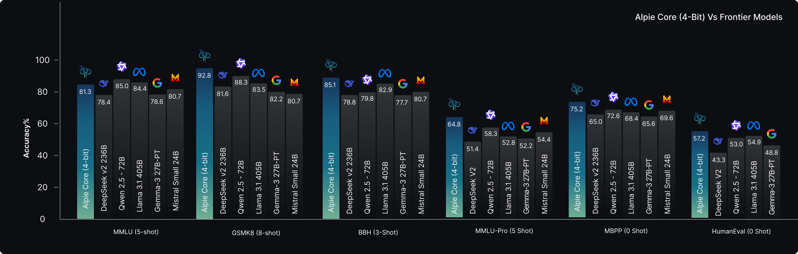
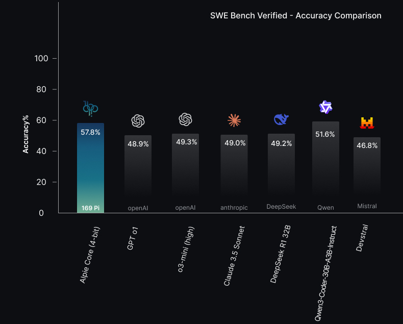
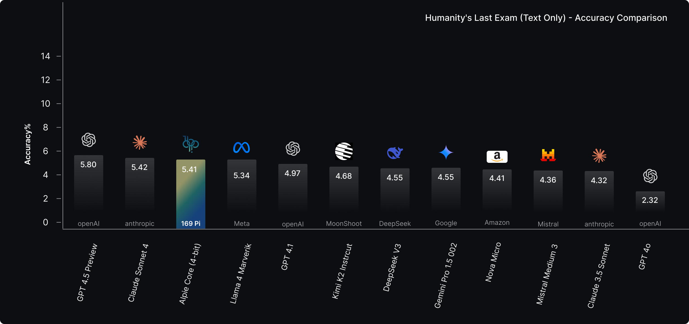
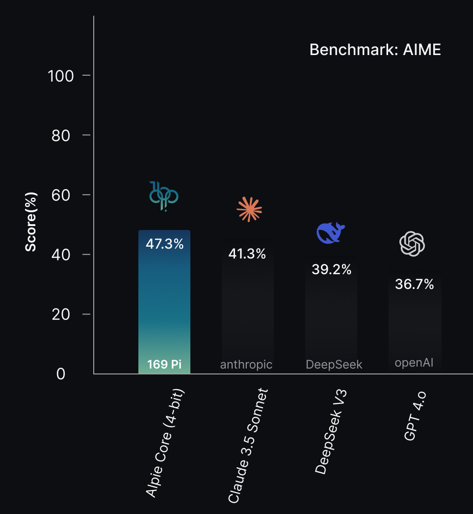
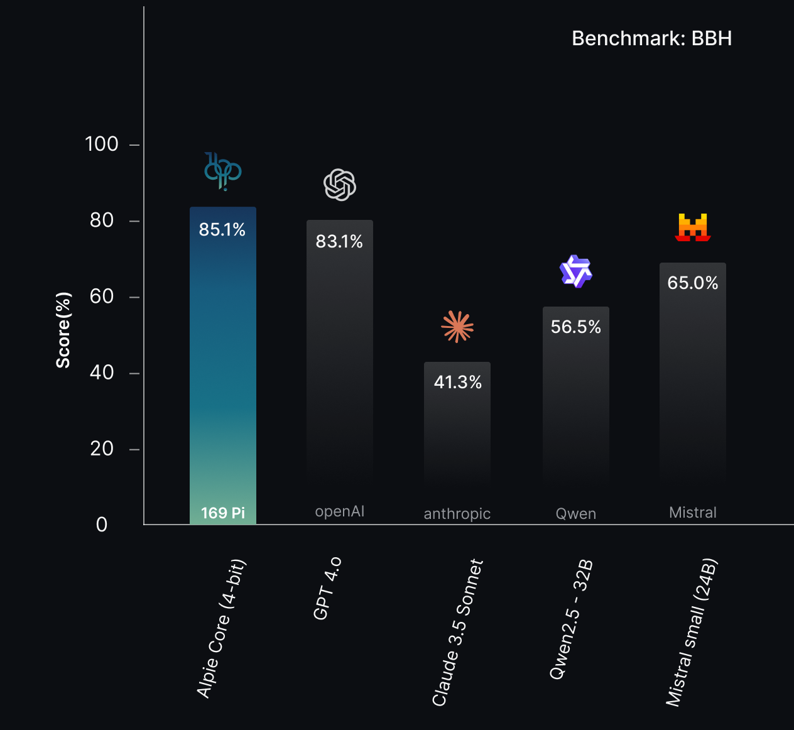

<div align="center">
  <picture>
      
  </picture>
</div>


<hr>

<p align="center">
  <a href="https://169pi.ai/" target="_blank" rel="noopener noreferrer"></a>
  <a href="https://huggingface.co/169Pi" target="_blank" rel="noopener noreferrer"></a>
  <a href="https://www.linkedin.com/company/169pi/" target="_blank" rel="noopener noreferrer"></a>
  <a href="https://x.com/169Pi_ai" target="_blank" rel="noopener noreferrer"></a>
  <a href="docs/Alpie_Core.pdf" target="_blank" rel="noopener noreferrer"></a>
</p>

## 1. Model Introduction

We introduce Alpie-Core, our first-generation reasoning model. It is a 32B-parameter system built on the DeepSeek-32B family and fine-tuned in 4-bit precision. By using quantization technique like QLoRA, along with synthetic dataset distillation, Alpie-Core achieves high efficiency in reasoning, mathematics, and coding tasks. It operates with much lower computational and memory costs. Even with its strong quantization, the model consistently outperforms 16-bit and 32-bit baselines. It achieves results like 81.28% on MMLU, 92.75% on GSM8K, and 57.8% on SWE-Bench Verified. Notably, Alpie-Core can be trained with just 8 NVIDIA Hopper GPUs, needing only 25% of the memory used by full-precision models. This repo covers the model's architecture, quantization strategy, training methods, benchmark results, technical innovations, use cases, safety and alignment features, limitations, and roadmap.


### Key Features
- **4-bit Quantization**: NF4 quantization with double quantization for strong compression.
- **Parameter-Efficient Training**: LoRA/QLoRA techniques allow fine-tuning with low resource needs.
- **Extended Context**: 65K token context length for managing large inputs and conversations.
- **Streaming Support**: Real-time, token-level response generation.
- **Resource Optimized**: Needs only about 16GB VRAM for deployment on standard hardware.

### Model Highlights
- **First 4-bit reasoning model from India** and one of the first globally at a 32B scale.
- **Trained on just 8 NVIDIA Hopper GPUs** showing efficient training methods.
- **Carbon footprint**: Just 298-835 kg CO₂e, much lower than full-precision options.
- **Improved content access**: Offers balanced responses to geopolitically sensitive topics.

<div align="center">
  <picture>
      
  </picture>
</div>

## 2. Model Summary


<div align="center">

<table>
  <tr>
    <td><b>Base Architecture</b></td>
    <td>DeepSeek-R1-Distill-Qwen-32B</td>
  </tr>
  <tr>
    <td><b>Total Parameters</b></td>
    <td>32B</td>
  </tr>
  <tr>
    <td><b>Quantization</b></td>
    <td>4-bit NF4 with double quantization</td>
  </tr>
  <tr>
    <td><b>Training Method</b></td>
    <td>LoRA/QLoRA fine-tuning</td>
  </tr>
  <tr>
    <td><b>Memory Footprint</b></td>
    <td>~16GB (75% reduction vs FP16)</td>
  </tr>
  <tr>
    <td><b>Context Length</b></td>
    <td>65K tokens</td>
  </tr>
  <tr>
    <td><b>Max Output Length</b></td>
    <td>16,384 tokens</td>
  </tr>
  <tr>
    <td><b>Training Hardware</b></td>
    <td>8× NVIDIA Hopper GPUs</td>
  </tr>
  <tr>
    <td><b>License</b></td>
    <td>Apache 2.0</td>
  </tr>
  <tr>
    <td><b>Specialization</b></td>
    <td>Reasoning, Mathematics, Coding</td>
  </tr>
</table>

</div>


## 3. Evaluation Results
### SWE-Bench Verified Performance

<div align="center">
  <picture>
    
  </picture>
</div>

### Humanity's Last Exam Leaderboard Performance
<div align="center">
  <picture>
    
  </picture>
</div>


### AIME (Advanced Mathematics)
<div align="center">
  <picture>
    
  </picture>
</div>


### BBH (Big-Bench Hard)
<div align="center">
  <picture>
    
  </picture>
</div>

### GSM8K (Grade School Math)
<div align="center">
  <picture>
    
  </picture>
</div>


## 4. Deployment

Our model checkpoints are stored in 4-bit quantized format, you can find it on [Hugging Face](https://huggingface.co/169Pi/Alpie-Core).

Currently, it is recommended to run Alpie-Core on the following inference engines:
* vLLM

Deployment examples for vLLM can be found in this [Model Deployment Guide](docs/deploy_guidance.md).


---
## 5. Model Usage

#### Non-Streaming Inference

```python
from transformers import AutoModelForCausalLM, AutoTokenizer
from peft import PeftModel, PeftConfig
import torch

# Load LoRA adapter configuration to find the base model
peft_model_id = "169Pi/Alpie-Core"
config = PeftConfig.from_pretrained(peft_model_id)

# Load the base model
base_model = AutoModelForCausalLM.from_pretrained(
    config.base_model_name_or_path,
    torch_dtype=torch.float16,
    device_map="auto"
)

# Load tokenizer
tokenizer = AutoTokenizer.from_pretrained(config.base_model_name_or_path)

# Load LoRA weights
model = PeftModel.from_pretrained(base_model, peft_model_id)

# Ensure evaluation mode
model.eval()

# Sample inference
prompt = "Solve the Riemann Hypothesis and provide a final answer?"
inputs = tokenizer(prompt, return_tensors="pt").to(model.device)

with torch.no_grad():
    outputs = model.generate(**inputs, max_new_tokens=1000)
    response = tokenizer.decode(outputs[0], skip_special_tokens=True)

print("Response:\n", response)
```


#### Streaming Inference
```python

from transformers import AutoModelForCausalLM, AutoTokenizer, TextStreamer
from peft import PeftModel, PeftConfig
import torch

# Load LoRA adapter configuration to find the base model
peft_model_id = "169Pi/Alpie-Core"
config = PeftConfig.from_pretrained(peft_model_id)

# Load the base model
base_model = AutoModelForCausalLM.from_pretrained(
    config.base_model_name_or_path,
    torch_dtype=torch.float16,
    device_map="auto"
)

# Load tokenizer
tokenizer = AutoTokenizer.from_pretrained(config.base_model_name_or_path)

# Load LoRA weights
model = PeftModel.from_pretrained(base_model, peft_model_id)

# Ensure evaluation mode
model.eval()

# Initialize streamer
streamer = TextStreamer(tokenizer, skip_prompt=True, skip_special_tokens=True)

# Sample streaming inference
prompt = "Solve the Riemann Hypothesis and provide a final answer?"
inputs = tokenizer(prompt, return_tensors="pt").to(model.device)

print("Streaming Response:")
with torch.no_grad():
    outputs = model.generate(
        **inputs,
        max_new_tokens=1000,
        streamer=streamer,
        do_sample=True,
        temperature=0.7,
        top_p=0.9
    )

```
---
## 6. License

[Apache 2.0 License](LICENSE) – Permissive, allowing free use, modification, and distribution for both research and commercial purposes.

---

## 7. Citation
```

@misc{169pi2025alpiecore,
  title     = {Alpie-Core: A 4-Bit Quantized Reasoning Model from India that Outperforms Full-Precision Models},
  author    = {169Pi AI},
  year      = {2025},
  url       = {https://huggingface.co/169Pi/Alpie-Core}
}

```
---
## 8. Acknowledgements / Credits

We want to thank DeepSeek for their original model, which was the basis for this work. Our team adjusted the model and used 4-bit quantization. This resulted in better efficiency and accuracy for our tasks. This model respects the contributions of the original authors and aims to provide a safe, high-performance solution for reasoning and inference.

We also appreciate the Hugging Face ecosystem (Transformers, PEFT, vLLM, bitsandbytes), the open-source community datasets (MMLU, GSM8K, SWE-Bench, and others), and the help from various cloud providers. Finally, we recognize the broader AI research community and companies whose innovations and insights keep inspiring our work.

---

## 9. Contact
If you have any questions or concerns, please reach out to us at **contact@169pi.com**
